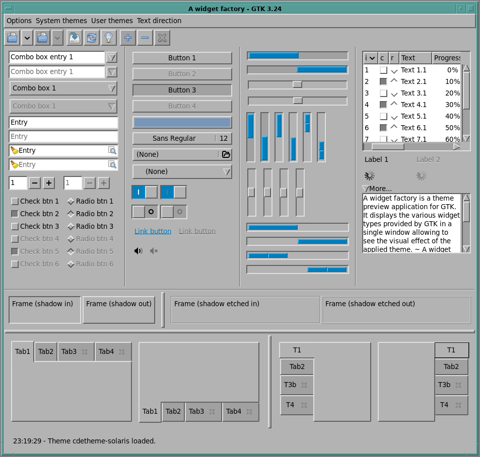

# backtrack-motif-theme
Yet another Motif-style GTK3 theme. This one is based off of the appearance of old Motif applications rather than on the thinner control borders that both HP and Sun used in CDE (or the even wilder things SGI did!). I forked it from my own Xfce3-Revival theme, so it does also take the same palette.css files.

I mainly created this a stepping-stone to other work, so I may or may not polish its remaining rough edges.

Extra color schemes provided with this theme:

| Name                  | Description                                          |
| --------------------- | ---------------------------------------------------- |
| DECWindows            | Based on how Motif looked on VMS                     |
| MidnightBrown         | A browner dark mode because my sister likes brown    |
| OpenCDE               | Based on how unbranded open-source CDE looks         |
| Paco                  | Colors from the Paco theme for easy night viewing    |
| SantaCruz             | Based on the appearance of Motif in SCO OpenServer   |
| Starlit               | Colors mostly from the Backwater-Moonlit theme       |

## Example
Here is what the theme looks like in practice:

## Limitations
- No option for thinner CDE-style borders
- No option for separataration of menubar and window body colors as seen in CDE. 
- No option for a separate system panel color as seen in CDE.
- Not tested on desktops other than XFCE
- No GTK-2 (or 4) version
- No XFWM theme -- but this is because Mofit already exists and is good!

## No Copyright Restrictions
Backtrack-Motif was written in entirety by Timothy Gaskell in 2026 and is placed in the public domain under the Creative Commons CC-0 public domain declaration. Please do not submit pull requests unless your code is also fully original and placed in the public domain.

In my experience, theme designers create first, share second, and think about paperwork only third if at all. There is much more danger of finding a theme that cannot be distributed because the author mixed GPL-2-only and GPL3 code or some such boring legal impossibility than of finding your theme co-opted by evil corporate interests. Accordingly, I prefer to share original work with as few strings as possible attached, not even requiring attribution.

Blessings,

Timothy N. Gaskell

Eastertide, 2026
